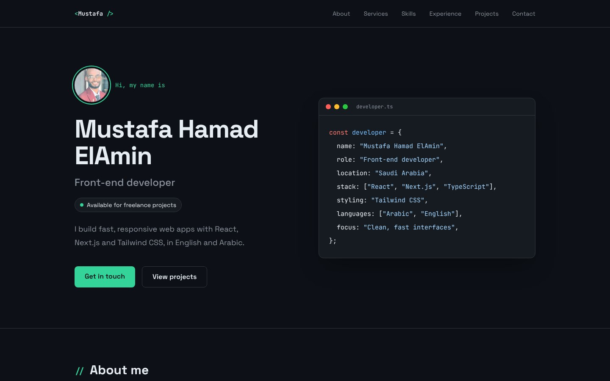

# Mustafa Hamad ElAmin — Personal Website

My portfolio site: who I am, what I work with, a few projects, and how to reach me.



## Sections

- **Hero** — name, role, photo and a code window with a quick profile
- **About me** — a short introduction and key facts
- **What I do** — the kinds of work I take on
- **Skills** — web development, programming, tools and IT support
- **Experience** — work history, education and certifications
- **Projects** — project cards; empty spots in the last row show "coming soon" placeholders
- **Contact** — email, LinkedIn and GitHub

## Adding a project

Open `app/components/Projects.tsx` and add an entry to the `projects` array. Each entry becomes a card and replaces one placeholder:

```ts
{
  name: 'My App',
  description: 'One or two sentences about what it does.',
  stack: ['Next.js', 'Tailwind CSS'],
  image: '/projects/my-app.png', // optional, a file in public/
  code: 'https://github.com/Mu21stafa23/my-app',
  demo: 'https://my-app.vercel.app',
},
```

## Design

A dark, code-editor style theme. Colors and fonts are defined once in `app/globals.css`:

| Token | Value | Used for |
| :-- | :-- | :-- |
| `ink` | `#0d1117` | Page background |
| `panel` | `#161b22` | Cards and the code window |
| `line` | `#30363d` | Borders and dividers |
| `fg` | `#e6edf3` | Main text |
| `mute` | `#8b949e` | Secondary text |
| `mint` | `#34d399` | Accent |

Text uses [Space Grotesk](https://fonts.google.com/specimen/Space+Grotesk); code-style details use [JetBrains Mono](https://fonts.google.com/specimen/JetBrains+Mono).

## Built with

- [Next.js 16](https://nextjs.org) (App Router)
- [React 19](https://react.dev)
- [TypeScript](https://www.typescriptlang.org)
- [Tailwind CSS 4](https://tailwindcss.com)

## Run it locally

```bash
npm install
npm run dev
```

Then open [http://localhost:3000](http://localhost:3000).

## Project structure

```
app/
├── components/
│   ├── Navbar.tsx      # Top navigation and mobile menu
│   ├── Hero.tsx        # Edit the `profile` array to change the code window
│   ├── Section.tsx     # Shared layout for the sections below the hero
│   ├── About.tsx
│   ├── Services.tsx    # The "What I do" cards
│   ├── Skills.tsx      # Edit the `skillGroups` array
│   ├── Experience.tsx  # Jobs, education and certifications
│   ├── Projects.tsx    # Edit the `projects` array
│   ├── Contact.tsx     # Contact links and footer
│   └── icons.tsx       # Menu icons used by the navigation
├── layout.tsx          # Page title, description and fonts
├── page.tsx            # Puts the sections together
└── globals.css         # Colors and fonts
public/                 # Photo, project screenshots and og.jpg (the link preview image)
```
